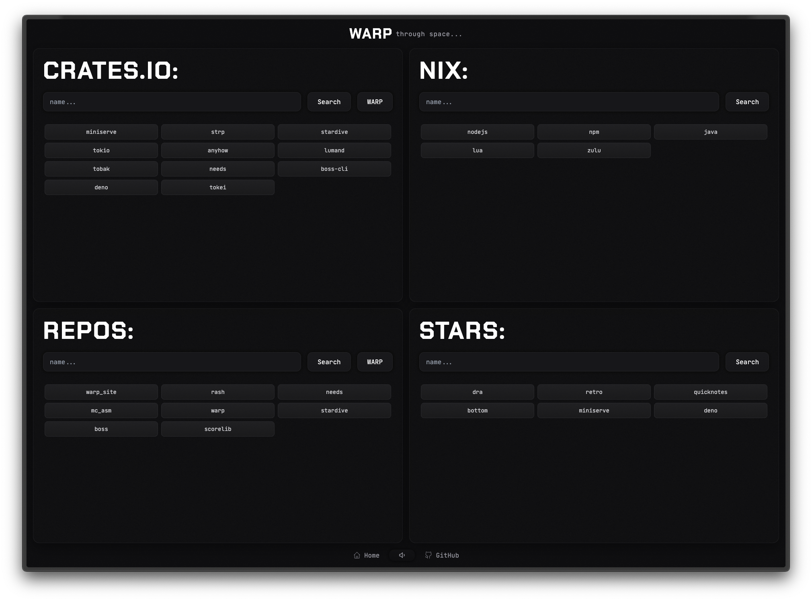

  <h1>WARP</h1>
  <h3></h3>
  <i>WARP through space! (or the web, whatever...)</i>
  <h3></h3>

  

## Usage

Goto: [WARP](https://warp.stardive.space) and search for crates, packages and my
repos+stars.

### Future:

- hotkeys
- responsive grids
- customizable panels for you own preferences!
- themes

Notes:
#FCFCFE, #ADAEE7, #6C6DAC, #565687, #41426E, #14152C

primary = background

secondary = card background

tertiary = textbox,button background

bg-hover = button hover

border primary = card border

border secondary = box,button border